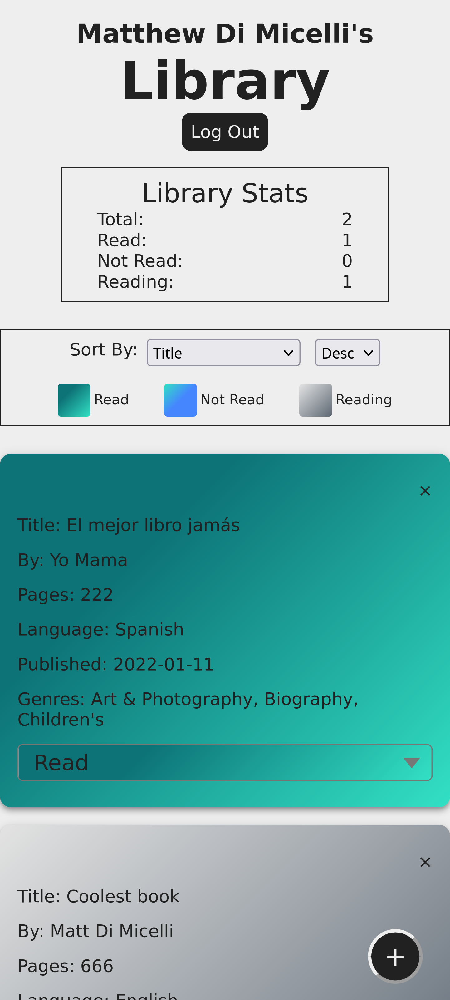

# Readme
# Library App

## Table of contents
  - [Overview](#overview)
    - [Challenge](#challenge) 
    - [Screenshot](#screenshot)
    - [Links](#links)
  - [My process](#my-process)
    - [Built with](#built-with)
    - [What I learned](#what-i-learned)

## Overview

A Library app which allows the user to keep track of his or her books.  The app 
allows the user to manage his or her book collection with as few or as many details
as the user desires, such as the book's author, title, date of publication, etc.
It has advanced features such as the ability to display the books sorted by different orders, as well as providing the user with some basic stats about their collection.
The app has responsive-design so that it can work on any device. Wanting to enable access to saved library data from any client, as well as allow multiple users, I implemented Google Firebase's Realtime (NoSQL) database and Authentication.  

### Challenge

I started with the design requirements which are spelled out in on the Library lesson page of The Odin Project [here](https://www.theodinproject.com/paths/full-stack-javascript/courses/javascript/lessons/library) and expanded them.

### Screenshot

  

### Links

- [Live site](https://mylibrary-mrd.web.app/)
- [Repo](https://github.com/mattdimicelli/library2)

## My process

### Built with

- It's all Vanilla... no frameworks
- Custom select element styles from moderncss.dev
- Modularization using ES6 modules
- OOP was utilized.  Constructor functions were used as per the design requirements laid out by The Odin Project.
- A mobile-first, responsive design
- Layout techniques such as CSS Grid and Flexbox
- Firebase Realtime Database.  I chose the Realtime Database for this project (as opposed to Firebase's newer Firestore database) to gain experience with a different data model, and since the database queries are so basic.  Furthermore, the data usage is really minimal, and JSON-structure data is ideal for this database.
- Firebase Authentication
- Webpack with a custom-made configuration.  Utilizes loaders and webpack dev server
- npm scripts for development and production purposes

### What I learned

I learned a lot building this app.  In an effort to create a nice "Read/Not Read/Reading" button, I "dove deep" into the HTML peculiarities of the `<select>` vs the "input datalist" option, and the implications that those options have with usability and styling.  I even ended up exploring some third-party libraries which enhance the `<select>` element with additional features, but ultimately ended up choosing to use the native `<select>` element with some styling code that I found on Google.  Furthermore, I created custom modals, and paid attention to HTML semantics, in order to make my website more accessible.  I practiced different methods of creating HTML, such as doing it directly (eg. insertAdjacentHTML()), as well as programatically using the DOM API.  Although this app probably is not suffiently demanding to see a performance improvement, I also utilized DocumentFragment which can improve re-rendering of the document and lead to increased performance (more likely in a larger application).  For the forms, I employed the HTML Constraint Validation API for validation, as well as custom sanitization.
  
I certainly learned much more, but these are just a few salient details that come to mind upon recollecting about the project.

